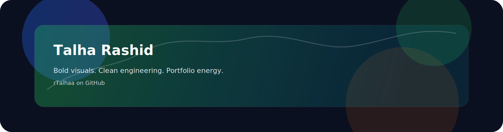

# Talha Rashid

  

  
  
  

## About

I'm Talha Rashid, and I build software that should look sharp before it even gets clicked. I like work that feels structured, visually strong, and fully thought through.

## Currently Building

- Sharper product pages and portfolio-style experiences
- Better visual storytelling around engineering projects
- Clean systems that feel finished, not just functional

## Core Identity

<table>
  <tr>
    <td>
      <strong>What I care about</strong> 
      Clear structure, polished delivery, and strong presentation.
    </td>
    <td>
      <strong>How I build</strong> 
      Python, JavaScript, React, and modern web tooling.
    </td>
    <td>
      <strong>What I enjoy</strong> 
      Turning scattered ideas into something impressive and complete.
    </td>
  </tr>
</table>

## Featured Work

<table>
  <tr>
    <td width="50%">
      <a href="https://github.com/rTalhaa/Islamabad-Land-Price-HeatMap"><strong>Islamabad Land Price HeatMap</strong></a> 
      Automated Islamabad land price heatmap and spatial visualization project.
    </td>
    <td width="50%">
      <a href="https://github.com/rTalhaa/SkinSync-RAG-Chatbot"><strong>SkinSync-RAG-Chatbot</strong></a> 
      AI skin analysis and skincare recommendation project.
    </td>
  </tr>
  <tr>
    <td width="50%">
      <a href="https://github.com/rTalhaa/Spotify-Clone-and-Music-Recommendation-System"><strong>Spotify-Clone-and-Music-Recommendation-System</strong></a> 
      Spotify-style clone with music recommendation functionality.
    </td>
    <td width="50%">
      <a href="https://github.com/rTalhaa/smart-right-click-browser-extension-v2"><strong>Smart Right Click Browser Extension v2</strong></a> 
      Browser productivity extension with improved interaction patterns.
    </td>
  </tr>
  <tr>
    <td width="50%">
      <a href="https://github.com/rTalhaa/Tox21-Molecular-Toxicity-MLOps-Platform"><strong>Tox21 Molecular Toxicity MLOps Platform</strong></a> 
      ML deployment project with MLOps-focused workflow and tooling.
    </td>
    <td width="50%">
      <a href="https://github.com/rTalhaa/portfolio"><strong>Portfolio</strong></a> 
      Personal portfolio website and project showcase.
    </td>
  </tr>
</table>

## Visual Stack

  
  
  
  
  
  
  
  

## GitHub Pulse

  
  

  

## Signature

<table>
  <tr>
    <td><strong>Bold</strong> Use contrast and hierarchy.</td>
    <td><strong>Creative</strong> Make the page memorable.</td>
    <td><strong>Professional</strong> Keep it clean and readable.</td>
  </tr>
</table>

## Contact

- GitHub: [github.com/rTalhaa](https://github.com/rTalhaa)
- Portfolio: [rTalhaa/portfolio](https://github.com/rTalhaa/portfolio)

---

  Built to feel like a high-impact portfolio header, not a scattered repo dump.

